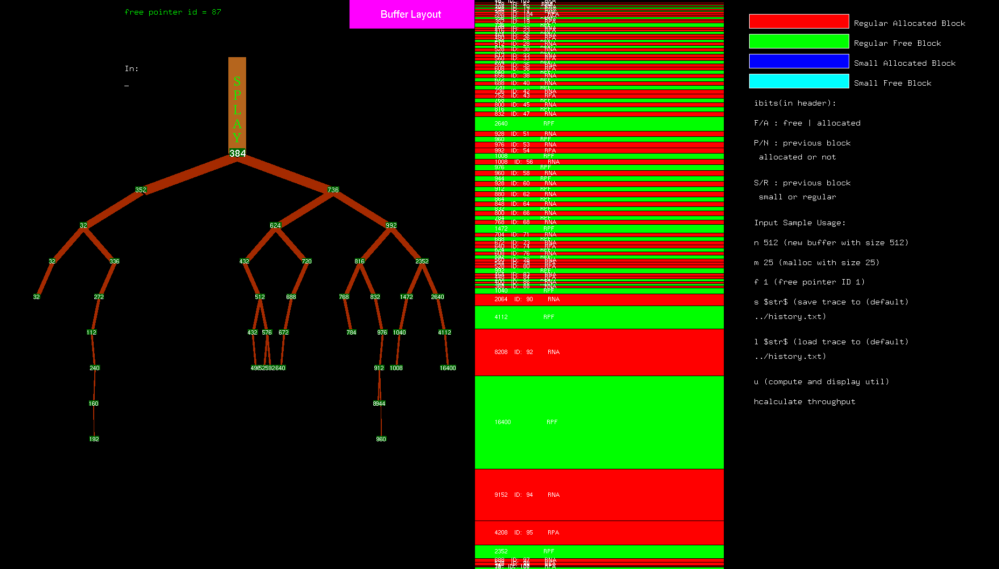

# Authored by Lingxi Zhang @ cmu in 2021/8/1

# Brief summary
A malloc visualizer using two-pointer splay tree.

# Example

# Sample usage
mkdir build && cd build \
cmake [-DDEBUG=ON/OFF] [-DOPENGL=ON/OFF] .. \
make && ./sample_test \
(command line) \
n 512 \
m 4 \
m 15 \
f 1 
